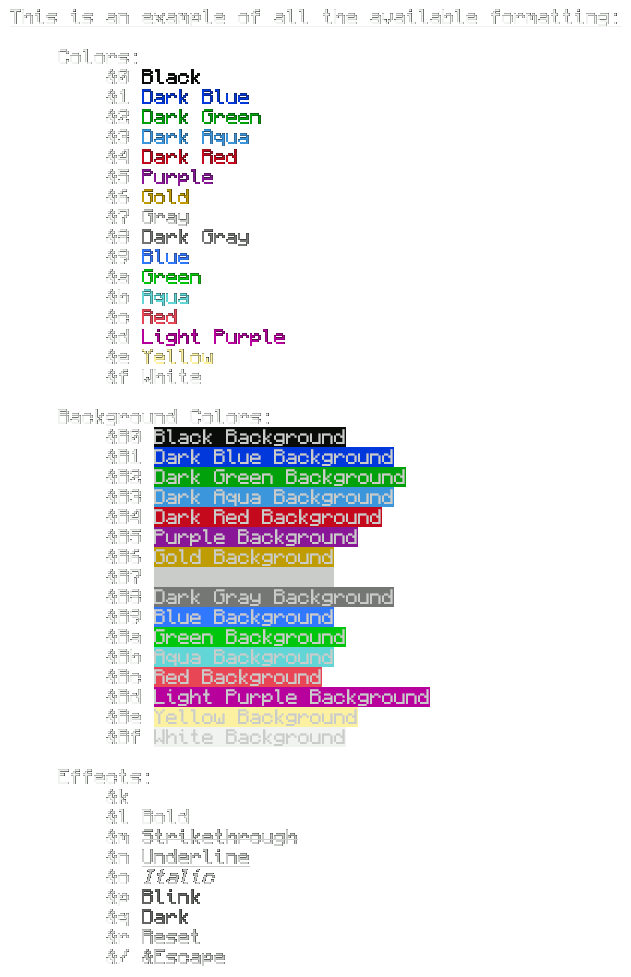

# Colmap v1.1
Simple python library, that provides functions to color text using minecraft-like color codes within the text itself, by replacing them with ANSI codes.

Will be made into a pip package and a PKGBUILD for Arch Linux later on.
## Usage:
Colmap provides two functions: _colmap()_ and _colprint()_
```python
from colmap import colmap, colprint

text = '&l&6example &btext &rwith &1color &0codes'

# mapping color codes to ANSI and assigning mapped text to a variable
colored_text = colmap(text)
print(colored_text)

# colprint() can take arguments of the print() function
# It uses the colmap() function and then prints the text
colprint(text, end='\n')
```
**Output:**

> printed using colmap() and built-in print(): <br />
<br />
> printed using colprint(): <br />
<br />

## Interactive run output:

> 
